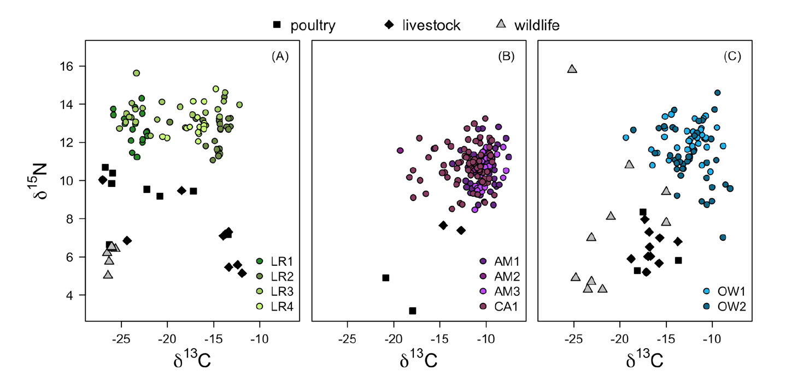
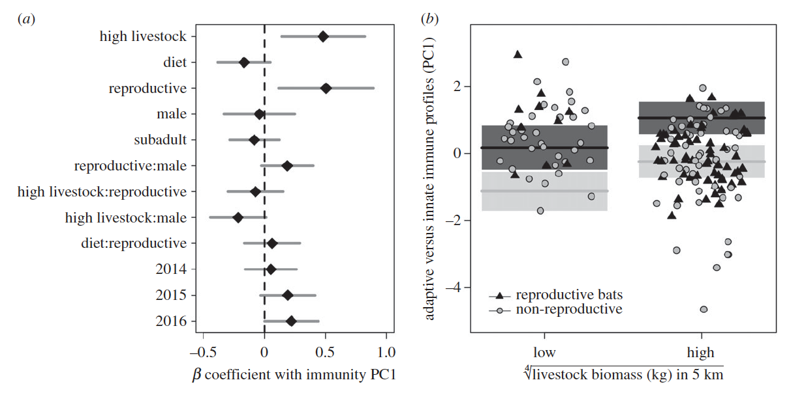

```{r setup, include=FALSE}
knitr::opts_chunk$set(
	echo = TRUE,
	warning = TRUE,
	message = TRUE,
	comment = "##",
	prompt = FALSE,
	tidy = TRUE,
	tidy.opts = list(blank = FALSE, width.cutoff = 75),
	fig.path = "img/",
	fig.align = "center"
)
```

## Introduction

Summary:
The intention of this paper is to understand the impact of provisioning on the imunne function and infection status of Vampire bats. This was condicted with a dataset containing measures the of immune function in 369 bats in peru and belize. The sites selected had varying amount of livestock and the immune profiles of bats were compared between high livestock biomass and low livestock biomass. It was found that the bats located in areas with high livestock biomass have more investment in innate immunity compared to adaptive immunity and this was much more noticiable in reproductive bats.

Reanalysis: 
The analysis that I am attempting to replicate is the generating of candidate models and model averaging used to identify predictors of bat immune profiles. Only the PC1 was provided, not the variables used to do the PCA so I ran the global model using the PCA 1 that was provided in the dataset as the response variable. 

## Visualization of Data

#### Read in the necessary packages for data visualization and the rest of the reanalysis.
```{r message=FALSE}
library(MuMIn) # for model generation and averaging
library(tidyverse) # for da tidy data
library(cowplot) # for da neato graphs
theme_set(theme_cowplot()) # setting a theme for the graphs
```

#### Get the data and head the first few rows...so I specified three rows
```{r}
# Read in the main dataset containig the bat data
d <- read_csv("data/becker et al_philtransbdata.csv",col_names = TRUE)
head(d, 3) # only the first few rows
```
```{r}
# Read in the prey isotope dataset, this is just used for recreating the first graph.
d2 <- read_csv("data/prey_isotopes.csv")
d2$class <- as.factor(d2$class) # This is for graphing the class in the plots
head(d2, 3)
```
### Visualizing stable isotopes of bats and prey across regions. 
There were not any summary tables of the variables in the paper or the supplement but there was a figure visualizing the isotopes of bats and cooresponding prey by site so I decided to attempt to replicate this figure. This figure can be located in the supplemenatry material as figure S2.

#### Figure from the supplement:


#### My figure:

Beginning by preparing the data. I pulled out all the sites from the bat dataset and the pre dataset. the prey dataset was only provided as a table in the supplement, so I formatted it in exel then saved as a csv to use in the graphs. 
```{r}
# Subsetting the sites
LR <- filter(d, site %in% c("LR1","LR2","LR3","LR4"))
head(LR, 3)

AM <- filter(d, site %in% c("AM1","AM2","AM3","CA1"))
head(AM, 3)

OW <- filter(d, site %in% c("OW1","OW2"))
head(OW, 3)

# Subsetting prey data by site.
LR_prey <- filter(d2, site %in% c("LR1","LR2","LR3","LR4","Rio Nanay (near Iquitos)"))
AM_prey <- filter(d2, site %in% c("Puerto Pakuy (near AM1–3)","CA1"))
OW_prey <- filter(d2, site %in% c("OW2", "Pacbitun (near OW1 & OW2)"))
```

Then moving on the to the graphing. I tried my best to format the graph in a way that looked even a little bit similar. If this has taught me anything, it is that I need to go over how to handle legends. It was difficult trying to have a common legend of prey type while still having individual level legends.That was the most stressfull part which I ended giving up on. Then I was just trying to get the legends inside their respective plots. Also, not a complete success.So I am apologizing in advance for how the multiplot looks....
```{r warning = FALSE, fig.width=10}
# Preparing the plots
pAM <- ggplot(NULL, aes(y = dn15, x = dc13)) + 
    geom_point(AM_prey, mapping = aes(shape = class)) +
    scale_shape_manual(values=c(18,15)) +
    geom_point(AM, mapping = aes(color = site)) +
    scale_color_manual(values = c("darkorchid4", "darkorchid3", "darkorchid1", "maroon3")) +
    theme(axis.line.x = element_blank(),
          axis.line.y = element_blank(),
          axis.title.y = element_blank(),
          axis.ticks.y = element_blank(),
          axis.text.y = element_blank(),
          legend.justification=c(0,1), legend.position=c(0,1),
          legend.text = element_text(size = 6),
          legend.title=element_text(size=6),
          panel.background = element_rect(color = 'black', size = 1)) +
    xlim(-30, -5) +
    ylim(4, 18)

pLR <- ggplot(NULL, aes(y = dn15, x = dc13)) + 
  geom_point(LR_prey, mapping = aes(shape = class)) +
  scale_shape_manual(values=c(18,15,24)) + 
  geom_point(LR, mapping = aes(color = site)) +
  scale_color_manual(values = c("forestgreen", "olivedrab", "olivedrab2", "olivedrab1")) +
  theme(axis.line.x = element_blank(),
        axis.line.y = element_blank(),
        legend.justification=c(0,1), legend.position=c(0,1), 
        legend.text = element_text(size = 6),
        legend.title=element_text(size=6),
        panel.background = element_rect(color = 'black', size = 1)) +
  xlim(-30, -5) +
  ylim(4, 18)

pOW <- ggplot(NULL, aes(y = dn15, x = dc13)) + 
  geom_point(OW_prey, mapping = aes(shape = class)) +
  scale_shape_manual(values=c(18,15,24)) + 
  geom_point(OW, mapping = aes(color = site)) + 
  scale_color_manual(values = c("steelblue1", "steelblue4")) +
  theme(axis.line.x = element_blank(),
        axis.line.y = element_blank(),
        axis.title.y = element_blank(),
        axis.ticks.y = element_blank(),
        axis.text.y = element_blank(),
        legend.justification=c(0,1), legend.position=c(0,1),
        legend.text = element_text(size = 6),
        legend.title=element_text(size=6),
        panel.background = element_rect(color = 'black', size = 1)) +
        xlim(-30, -5) +
        ylim(4, 18)

plot_grid(pLR, pAM, pOW, labels = c('A', 'B', 'C'), label_size = 12, nrow = 1, rel_widths = c(1.15,1,1))
```

## Replications/Reanalysis
### Analysis with PC1, generating and averaging models. 
When setting up the global model, I attempted to use lmer() where ID nested in site was the random effect. However, I kept having issues trying to run the model that way. This was consistent for the other models I attempted to run for the other analysis mentioned in the paper (like when I was trying to replicate figure 2, for example). To remedy this I tried using just ID for the random effect and it still would not run. I am not sure how site and ID variable were handled by the authors for them to be incoporated into the models properly.So for the following section I ran the global model using the lm() with no random effects. The coeffecients may be much different as this is not accounting for resampling of individuals in the dataset. In addition, not all of the interactions used in the original analysis are specified in the paper. My reanalysis will not have the same number of models generated for this reason. 

#### Step 1. Setting up global model for model generation and averaging.
```{r}
# The paper mentioned not including rows with NAs so I removed them and selected for the variables needed for this analysis. 
d.mod.build <- drop_na(d) %>%
  select(ID, site, livestock, idistance, year, age, sex, rep, pca1)
d.mod.build

d.mod.build$year <- as.factor(d.mod.build$year)
d.mod.build$livestock <- as.factor(d.mod.build$livestock)

# Then set up the globa models with all the main effects and as many ineractions as I could think of.
mod <- lm(pca1 ~ livestock + idistance + year + age + sex + rep + livestock*sex + rep*sex + livestock*rep 
          + idistance*rep + idistance*sex, data = d.mod.build)
summary(mod) # summary from the model
```

#### Step 2. Model generating
Then I generated models with the dredge funtion in the MuMIn package, indicating that models can only have up to 4 terms as specified in the paper. When viewing the top 20 models, the top model is the livestock and reproduction. At least that part is consistent with the paper..... 
```{r}
options(na.action = "na.fail") #needed for the dredge function
combo3 <- dredge(mod, m.lim = c(1,4), beta = "partial.sd")# model generating.
head(combo3, 20) # the top 20 models
```

#### Step 3. Model averaging
The paper mentions averaging models whose cumulative Akaike weight adds up to 95%. I am not sure if that is actually what I did here but I did try. 
```{r}
#summary of the model 
(mod_avg <- summary(model.avg(combo3), subset = (cumsum(weight) = .95))) 
```

#### Step 4. Recreating Figure 3 
After doing the model avearging, the coefficients were plotted and the results from the best fitting model are plotted. The averaged 

#### The figure from the paper:


#### My recreation: 
Since it took so long to attempt to figure out what the issue was with the random effects, I only had time to recreate Panel A. I pulled out the the model coefficients from the model averaging summary. Then calvulated the confidence intervals to be used for the error bars. I combine the coefficients and CIs into one data frame. Then graph! The reference group for livestock biomass for them was the low biomass category. For me, it was high biomass.
```{r}
df1 <- as.data.frame(mod_avg$coefmat.full) # grab the full model coefficients
CI <- as.data.frame(confint(mod_avg, full=T)) 
total <- cbind(df1, CI) # bind them together

total <- total %>% # make the row names into a column called coefficent
  rownames_to_column("coefficient")

(pAVG <- ggplot(data=total[2:12,], aes(x = coefficient, y = Estimate)) + 
    geom_hline(yintercept = 0, color = "black", linetype="dashed") + # put line at 0
    geom_errorbar(aes(ymin =`2.5 %`, ymax =`97.5 %`), color="grey", 
                  width = 0, lwd = 1) + # add the error bars
    coord_flip()+ # flipping axes
    geom_point(size=3, shape = 18)+ ylab(expression(paste(beta," coefficient with immunity PC1"))) + xlab(element_blank()))
    # plot coefficients
```

## Summary/Discussion

This was not a successful reanalysis because:
- Had difficulties which I believe were a combiation of not entirely understanding how to set up glmms, not understading how the ID and site were handled for models to run properly.
- There were several columns of data that were not provided so I could not do the PCA on my own. The PCAs were provided as single columns (pca1 and pca2). The second PCA was not mentioned or I didn't see it at least.
- not all the interactions used for the global model were provided so I definitely could've left some out and I do not have the same candidate models in my top 20 like in table 1. only had 81 models compared to the 86. I did not know what all should be included in "appropriate interactions". 
- No specific functions were mentioned in the paper but there were a couple of packages for the model avearging. So I looked through the 
- No mention of what was used for the PERMANOVA. I assumed the vegan package but there was not any info regarding some of the arguments needed for the PERMANOVA. If I were to set up a martix, did I need to set up a dissimilarity matrix? What method? So I had trouble with running the test after creating the matrix of the two isotopes, eventually giving up. 

TL;DR: Reanalysis was not successful and a bit stressful...

## References
Becker, D. J., Czirják, G. Á., Volokhov, D. V., Bentz, A. B., Carrera, J. E., Camus, M. S., Navara, K. J., Chizhikov, V. E., Fenton, M. B., Simmons, N. B., Recuenco, S. E., Gilbert, A. T., Altizer, S., & Streicker, D. G. (2018). Livestock abundance predicts vampire bat demography, immune profiles and bacterial infection risk. Philosophical transactions of the Royal Society of London. Series B, Biological sciences, 373(1745), 20170089. https://doi.org/10.1098/rstb.2017.0089


